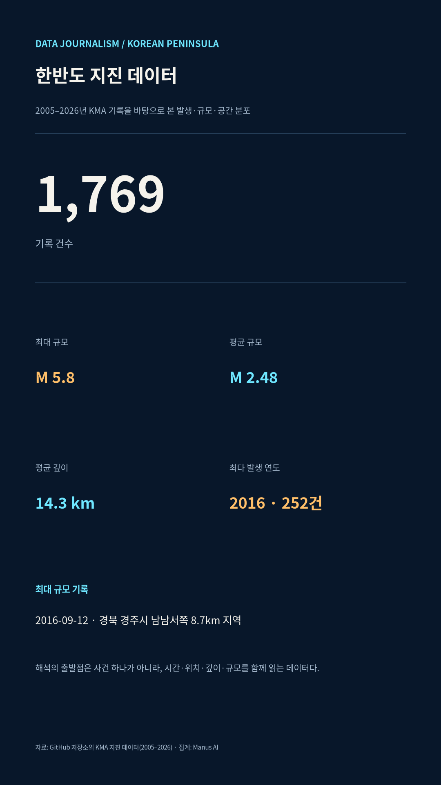
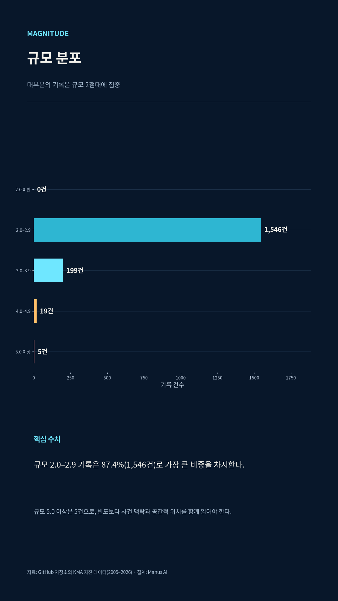
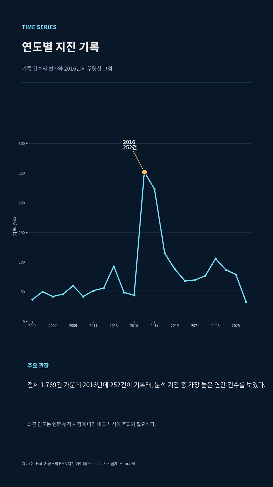
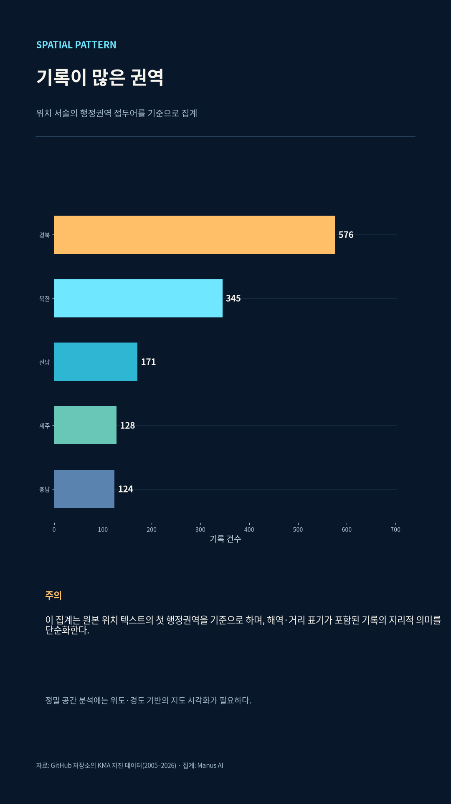

# 1,769개의 기록, 한반도 지진을 읽는 방법

> **분석 기준일:** 2026년 6월 16일  
> **분석 범위:** 2005년 2월 3일~2026년 6월 16일  
> **데이터:** 기상청 지진·깊이·진도 기록을 바탕으로 정리한 1,769건의 사건 기록 [1]

한반도 지진을 설명할 때 가장 먼저 떠오르는 것은 강한 한 번의 흔들림일 수 있다. 그러나 지진 기록을 시간·규모·공간·데이터 품질의 네 축으로 나누어 읽으면 이야기는 달라진다. 이 분석에 포함된 1,769건은 ‘큰 지진이 몇 번 있었는가’만을 보여 주지 않는다. 대부분은 규모 2점대의 작은 흔들림이지만, 특정 시기의 기록 집중과 지역·해역에 걸친 분포, 그리고 관측 항목별 결측이 함께 드러난다. 즉, 지진 데이터는 위험을 단순 예측하는 숫자가 아니라, 무엇이 기록되었고 무엇은 아직 충분히 기록되지 않았는지를 확인하는 출발점이다.

## 작은 흔들림이 기록의 대부분을 이룬다

전체 기록의 평균 규모는 **2.48**, 중앙값은 **2.4**다. 가장 빈도가 높은 구간은 규모 **2.0~2.9**로 1,546건이며, 전체의 **87.4%**를 차지한다. 반대로 규모 4.0 이상은 24건, 규모 5.0 이상은 5건에 그친다. 규모가 큰 사건은 적지만 사회적 영향은 훨씬 클 수 있다. 따라서 빈도만으로 위험도를 판단해서는 안 되며, 작은 규모 기록의 축적과 고규모 사건의 맥락을 분리해 읽어야 한다.

| 규모 구간 | 기록 건수 | 전체 대비 비중 | 읽는 방식 |
|---|---:|---:|---|
| 2.0~2.9 | 1,546건 | 87.4% | 일상적 관측 기록의 중심을 이룬다. |
| 3.0~3.9 | 199건 | 11.2% | 체감·관심도가 높아질 수 있는 중간 규모 구간이다. |
| 4.0~4.9 | 19건 | 1.1% | 지역별 맥락과 당시의 통보 내용을 함께 확인해야 한다. |
| 5.0 이상 | 5건 | 0.3% 미만 | 빈도는 낮지만 분석에서 별도 사건 단위로 다뤄야 한다. |

이 분포가 말해 주는 것은 단순하다. 한반도 지진 기록의 중심은 대형 사건이 아니라 작은 규모의 반복된 관측이다. 하지만 이것이 곧 ‘위험이 작다’는 뜻은 아니다. 규모는 지진 자체의 에너지와 관련된 하나의 지표일 뿐이며, 실제 체감과 피해는 진앙 거리, 깊이, 지역의 건축 환경, 시간대 등 여러 조건의 영향을 함께 받는다. 데이터저널리즘의 역할은 빈도 그래프를 공포나 안심의 근거로 바꾸는 것이 아니라, 숫자가 답하지 못하는 질문을 명확히 남기는 데 있다.

## 연도별 기록은 2016~2017년에 뚜렷하게 솟는다

연도별 기록을 놓고 보면 가장 큰 봉우리는 **2016년 252건**이다. 이어 2017년에도 223건이 기록됐다. 이 두 해의 변화는 규모 5.8의 2016년 9월 12일 경주 인근 지진과 규모 5.4의 2017년 11월 15일 포항 인근 지진을 포함한 시기와 겹친다. 데이터는 이 시기에 기록이 집중됐다는 사실을 보여 주지만, 연도별 건수만으로 특정 사건의 인과관계나 장기적 추세를 단정할 수는 없다. 사건 이후의 여진·통보 기준·관측 체계와 같은 조건을 함께 검토해야 한다.

| 주요 시점 | 규모 | 위치 | 깊이 | 이 분석에서의 의미 |
|---|---:|---|---:|---|
| 2014-04-01 | 5.1 | 충남 태안군 서격렬비도 서북서쪽 100km 해역 | 8km | 해역 기록도 고규모 사건 분석에서 분리할 수 없음을 보여 준다. |
| 2016-07-05 | 5.0 | 울산 동구 동쪽 52km 해역 | 19km | 2016년 기록 집중 이전의 해역 사건이다. |
| 2016-09-12 | 5.8 | 경북 경주시 남남서쪽 8.7km 지역 | 15km | 분석 기간 최대 규모 기록이다. |
| 2016-09-12 | 5.1 | 경북 경주시 남남서쪽 8.2km 지역 | 15km | 같은 날의 기록을 사건 단위로 읽어야 함을 보여 준다. |
| 2017-11-15 | 5.4 | 경북 포항시 북구 북쪽 8km 지역 | 7km | 이듬해에도 높은 기록 수가 이어진 맥락을 제공한다. |

월별 합계에서는 9월이 250건으로 가장 많고, 11월이 201건으로 뒤를 잇는다. 그러나 이 수치는 여러 해의 기록을 한데 합친 결과다. 특정 달의 합계가 높다는 사실만으로 계절성이 있다고 결론 내릴 수는 없다. 특히 분석 기간에 포함된 고규모 사건과 그 주변 기록이 월별 합계를 끌어올렸을 가능성을 분리해 확인해야 한다. 이처럼 집계 단위는 패턴을 발견하게 하지만, 동시에 잘못된 일반화를 경계하게 만든다.

## 지도는 ‘어디에서’보다 ‘어떻게 분류했는가’를 먼저 묻는다

원자료의 위치 텍스트 첫 행정권역을 기준으로 단순 집계하면 경북이 576건으로 가장 많고, 북한 345건, 전남 171건, 제주 128건, 충남 124건이 뒤를 잇는다. 하지만 이 순위는 지질학적 위험도 순위가 아니다. 위치 문장에 포함된 행정권역을 기준으로 텍스트를 정리한 결과이며, 해역·거리·방향이 섞인 서술형 위치를 하나의 권역으로 환원한 값이다.

| 위치 텍스트 기준 상위 권역 | 기록 건수 | 해석의 주의점 |
|---|---:|---|
| 경북 | 576건 | 경주·포항 인근을 포함하지만, 이 수치만으로 지역 전체의 위험을 뜻하지는 않는다. |
| 북한 | 345건 | 행정구역·해역 서술이 함께 있어 위치 텍스트의 맥락을 확인해야 한다. |
| 전남 | 171건 | 서남해와 도서 지역을 포함하는 기록의 특성을 고려해야 한다. |
| 제주 | 128건 | 섬·해역 주변 기록이 함께 포함될 수 있다. |
| 충남 | 124건 | 태안 인근 해역 기록이 집계에 영향을 줄 수 있다. |

전체 기록 가운데 위치 문구에 ‘해역’이 들어간 사건은 739건으로 **41.8%**다. 반대로 지역으로 분류된 기록은 1,030건이다. 이는 한반도 지진을 육상 행정구역 중심의 지도만으로 해석하기 어렵다는 뜻이다. 지도를 볼 때는 점의 개수뿐 아니라, 육상·해역 필터를 바꿨을 때 분포가 어떻게 달라지는지 함께 살펴야 한다.

좌표 기반 산점도는 이 한계를 보완한다. 서술형 위치가 어떤 행정권역으로 시작하는지와 별개로, 위도·경도는 기록이 넓은 해역과 육상에 걸쳐 어떻게 놓이는지 보여 준다. 다만 좌표의 밀집은 관측망, 통보 기준, 특정 사건의 여진 기록과도 연결될 수 있다. 그래서 지도는 ‘위험 지역을 단정하는 도구’가 아니라, 추가 취재와 검증이 필요한 지점을 찾는 도구로 써야 한다.

## 깊이 데이터는 분석의 가능성과 한계를 함께 보여 준다

1,769건 중 깊이 값이 채워진 기록은 1,276건으로 **72.1%**다. 유효값만 놓고 본 평균 깊이는 14.3km, 중앙값은 14.0km다. 깊이는 진앙의 수평 위치와 다른 차원의 정보이므로, 같은 규모라도 발생 깊이에 따라 지표에서 느끼는 양상은 달라질 수 있다. 하지만 이 데이터에서는 약 27.9%의 기록에 깊이가 비어 있다. 결측을 0으로 채우거나 유효값 평균을 전체 기록의 평균처럼 표현하면 분석은 왜곡된다.

| 필드 | 채워진 기록 | 충족률 | 기사·시각화에서의 처리 |
|---|---:|---:|---|
| 발생일시·규모 | 1,769건 | 100% | 연도·월·규모 분포의 기본 지표로 사용했다. |
| 좌표 | 1,769건 | 100% | 공간 분포와 지도 탐색에 사용했다. |
| 깊이 | 1,276건 | 72.1% | 유효값만으로 평균·중앙값을 계산했다. |
| 최대진도 | 0건 | 0% | 이번 집계 지표와 인포그래픽에서는 제외했다. |

이 결측은 데이터의 ‘실패’가 아니다. 오히려 어떤 질문에 답할 수 있고, 어떤 질문에는 아직 답할 수 없는지를 알려 주는 메타데이터다. 페이지에 최대진도 그래프를 넣지 않은 이유도 여기에 있다. 유효값이 없는 필드를 그럴듯한 시각 요소로 채우는 대신, 비어 있음을 공개하는 것이 데이터저널리즘의 기본 원칙에 더 가깝다.

## 기록을 읽는 일은 예측을 약속하는 일이 아니다

이 분석은 지진 발생 가능성을 예측하거나 특정 지역의 안전을 판정하는 보고서가 아니다. 기상청의 지진정보 API는 국내에서 규모 2.0 이상 지진이 발생한 경우의 발표 자료를 제공하고, 발생시각·위치·규모·깊이·계기진도 등의 요소를 안내한다.[2] 따라서 이 페이지는 공개된 기록을 바탕으로 ‘관측된 사건’을 설명한다. 기록되지 않은 사건, 관측 기준의 변화, 통보의 수정·재통보, 그리고 실제 피해의 차이는 별도의 검증이 필요하다.

> **독자를 위한 세 가지 질문**  
> 첫째, 이 그래프는 발생 빈도를 보여 주는가, 아니면 피해를 보여 주는가.  
> 둘째, 이 지도에서 해역 기록과 육상 기록은 같은 기준으로 읽히는가.  
> 셋째, 빈칸은 실수인가, 아니면 현재 데이터가 답하지 못하는 범위인가.

인터랙티브 지도에서는 규모 구간, 기간, 육상·해역, 점·클러스터·히트맵 표시를 직접 바꾸어 볼 수 있다. 그래프와 지도는 결론을 대신하지 않는다. 대신 우리가 무엇을 더 확인해야 하는지, 그리고 다음 갱신에서 어떤 기록이 추가됐는지를 추적할 수 있게 만든다.

## 데이터·방법

이 기사는 저장소의 `KMA_지진_깊이진도_2005_2026.csv`를 정제한 1,769건을 분석했다. 발생일시로 연도와 월을 집계하고, 규모는 원자료의 수치를 구간화했다. 권역 분포는 위치 텍스트의 첫 행정권역을 기준으로 한 단순 집계이며, 해역 여부는 위치 문구에 ‘해역’이 포함됐는지로 분류했다. 깊이 통계는 결측을 제외한 유효값으로 계산했다. 이 방법은 재현 가능성을 위해 페이지와 함께 공개하며, 향후 공식 API 갱신 시 동일한 기준으로 다시 계산한다.

## 참고자료

[1]: https://github.com/Neosiki/korean-earthquake-data-journalism/blob/main/KMA_%EC%A7%80%EC%A7%84_%EA%B9%8A%EC%9D%B4%EC%A7%84%EB%8F%84_2005_2026.csv "한반도 지진 원자료 CSV"
[2]: https://apihub.kma.go.kr/apiList.do?seqApi=7 "기상청 지진·화산 OPEN-API"
